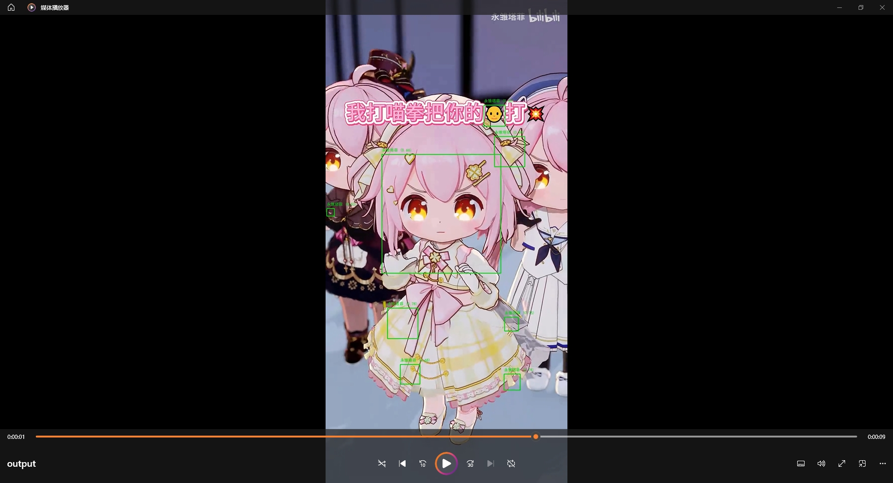
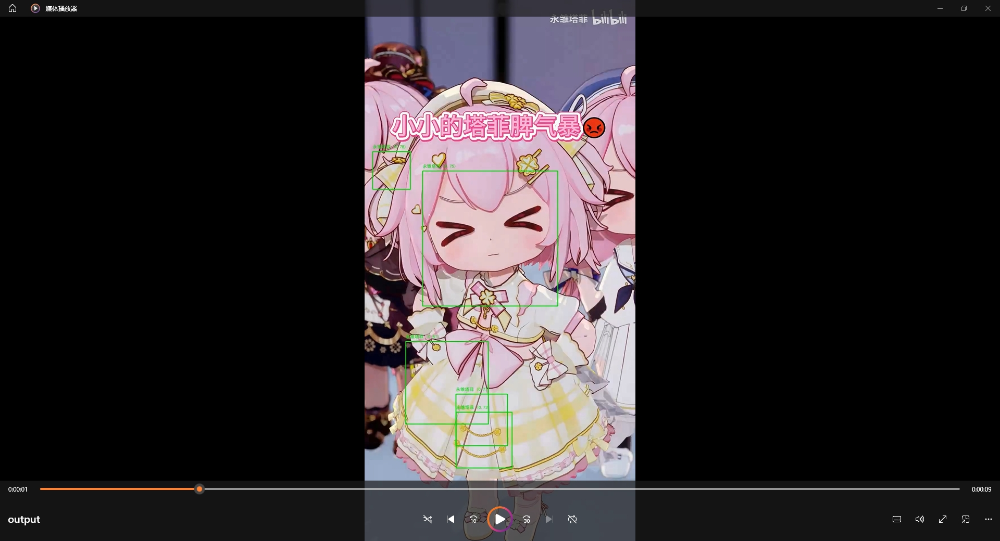

# MoeFace - 动漫人脸识别系统

MoeFace 是一个专为动漫/虚拟主播角色设计的人脸识别系统，支持图片特征库构建、视频实时识别、摄像头实时检测等功能，可自动识别视频中的特定动漫角色并标注名称和相似度。

## 目录结构
```
MoeFace/
├── data/               # 角色图片库（每个角色一个文件夹）
├── features/           # 特征库JSON文件（自动生成）
├── temp/               # 临时文件目录
├── demo/              #示例图片
├── 视频示例/           # 示例视频文件
│   └── taffy.mp4       # 示例视频
├── lbpcascade_animeface.xml  # 动漫人脸检测分类器
├── simhei.ttf          # 中文字体文件
├── 爬虫.py             # 角色图片爬取工具
├── recognize.py        # 核心识别程序
├── requirements.txt    # 依赖包列表
├── LICENSE             # 许可证文件
└── readme.md           # 使用说明
```

## 功能特点
- 🎭 **动漫人脸检测**：基于OpenCV的动漫人脸分类器，精准检测动漫/虚拟主播人脸
- 🧠 **特征提取与匹配**：使用FaceNet模型提取人脸特征，余弦相似度匹配
- 📸 **批量图片爬取**：自动从必应图片爬取指定角色图片，构建特征库
- 🎬 **视频处理**：支持视频文件识别、摄像头实时识别，输出带标注的视频
- 🔤 **中文支持**：完美显示中文角色名称，支持关键词映射
- ⚡ **高性能**：支持跳帧处理，提升视频处理速度
- 💾 **特征库缓存**：特征库自动保存为JSON，避免重复计算

## 示例
[taffy.mp4](https://github.com/ciallo0721-cmd/MoeFace/releases/download/moeface/taffy.mp4)

## 环境要求
- Python 3.7+
- Windows/Linux/macOS
- 可选：NVIDIA GPU（CUDA）加速

## 安装步骤

### 1. 安装依赖
```bash
pip install -r requirements.txt
```

requirements.txt 包含以下核心依赖：
- opencv-python
- torch
- torchvision
- facenet-pytorch
- numpy
- pillow
- requests
- beautifulsoup4
- moviepy（可选，用于保留视频音频）

### 2. 准备分类器文件
确保 `lbpcascade_animeface.xml` 文件存在于根目录（已提供）

### 3. 中文字体
`simhei.ttf` 字体文件已提供，用于显示中文角色名称

## 使用指南

### 一、构建角色图片库

#### 方法1：手动添加
在 `data/` 目录下创建角色名称的文件夹，放入该角色的图片（jpg/png/webp等格式）

#### 方法2：自动爬取
使用爬虫脚本自动从必应图片爬取角色图片：
```bash
python 爬虫.py
```
- 脚本会自动处理 `data/` 目录下的所有角色文件夹
- 每个角色默认爬取最多10张图片
- 内置了部分角色的关键词配置（可在代码中修改）
- 自动跳过已存在的图片，避免重复

### 二、人脸识别

#### 1. 列出可用的特征库
```bash
python recognize.py --list
```
查看所有可识别的角色和关键词映射关系

#### 2. 处理视频文件
```bash
# 基本用法
python recognize.py --source 视频示例/taffy.mp4 --output output.mp4

# 自定义阈值和跳帧（提升速度）
python recognize.py --source 视频示例/taffy.mp4 --output output.mp4 --threshold 0.45 --skip_frames 2

# 指定特征库
python recognize.py --source 视频示例/taffy.mp4 --output output.mp4 --db_name 永雏塔菲
```

#### 3. 摄像头实时识别
```bash
# 仅显示识别结果（无保存）
python recognize.py --camera --source 0

# 保存摄像头识别结果
python recognize.py --camera --source 0 --output camera_output.mp4
```

#### 4. 强制重建特征库
```bash
python recognize.py --source 视频示例/taffy.mp4 --output output.mp4 --rebuild
```

### 三、参数说明
| 参数 | 说明 | 默认值 |
|------|------|--------|
| --data | 特征库图片文件夹路径 | ./data |
| --source | 视频文件路径或摄像头ID | 无 |
| --camera | 使用摄像头模式 | False |
| --output | 输出视频路径 | 无 |
| --threshold | 识别阈值（相似度） | 0.45 |
| --skip_frames | 跳帧数（越大越快） | 1 |
| --rebuild | 强制重新构建特征库 | False |
| --db_name | 指定特征库名称 | 自动识别 |
| --list | 列出可用特征库 | False |

## 关键词映射
系统内置了关键词映射，例如：
- "塔菲"、"雏草姬" → 永雏塔菲
- "东雪莲"、"罕见" → 东雪莲
- "Neuro"、"牛肉" → Neuro-sama
- 可在 `recognize.py` 的 `KEYWORD_MAPPING` 中自定义

## 注意事项

1. **识别精度**：
   - 阈值（threshold）默认0.45，值越高越严格，越低越宽松
   - 建议为每个角色准备至少5张不同角度的图片
   - 图片质量越高，识别效果越好

2. **性能优化**：
   - 使用 `--skip_frames` 参数跳帧处理，提升视频处理速度
   - 启用CUDA（GPU）可大幅提升特征提取速度
   - 特征库首次构建较慢，后续会缓存为JSON文件

3. **视频处理**：
   - 输出视频默认使用mp4格式
   - moviepy库可选，未安装时视频无音频
   - 处理大视频时会生成临时文件，完成后自动清理

4. **爬虫使用**：
   - 爬取频率已做限制，避免被封禁
   - 部分网站可能有反爬机制，导致爬取失败
   - 建议爬取后手动检查图片质量

5. **Bug**
   - 动漫人脸检测分类器（lbpcascade_animeface.xml）存在误识别情况，可能将角色的衣物、装饰等非人脸区域错误识别为人脸
   - 该问题在识别 “永雏塔菲” 角色时表现尤为明显，具体可参考以下示例截图：
   
   
   
   
   
   
   

## 自定义配置

### 1. 添加新角色
1. 在 `data/` 目录创建新角色文件夹
2. 在 `爬虫.py` 中添加角色的关键词（可选）
3. 在 `recognize.py` 的 `KEYWORD_MAPPING` 中添加关键词映射（可选）

### 2. 修改识别参数
- 调整 `recognize.py` 中的 `threshold` 改变识别灵敏度
- 修改人脸检测参数（scaleFactor、minNeighbors等）调整检测范围

### 3. 扩展功能
- 支持更多角色的关键词配置
- 可修改爬取数量（MAX_IMAGES_PER_ROLE）
- 调整并发下载线程数（DOWNLOAD_THREADS）

## 故障排除

1. **分类器加载失败**：
   - 检查 `lbpcascade_animeface.xml` 文件是否存在
   - 确认文件路径正确

2. **中文字体显示乱码**：
   - 确保 `simhei.ttf` 文件存在
   - 替换为其他中文字体文件

3. **识别效果差**：
   - 增加角色图片数量
   - 调整阈值参数
   - 检查图片质量（确保清晰的人脸）

4. **视频处理无音频**：
   - 安装 moviepy：`pip install moviepy`
   - 检查输出视频格式是否支持音频

5. **CUDA Out of Memory**：
   - 降低批处理大小
   - 使用CPU模式（自动 fallback）

## 许可证
本项目基于开源许可证发布（详见 LICENSE 文件）

## 免责声明
- 爬虫脚本仅用于学习研究，请勿用于商业用途
- 请遵守目标网站的robots协议
- 本项目仅用于个人学习和非商业用途